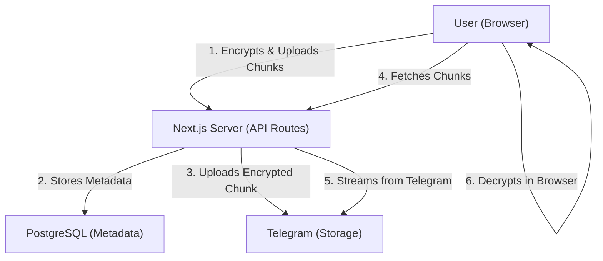

# System Architecture

This document provides a high-level overview of the Telegram File Management system's architecture.

## Overview

The Telegram File Management system is a secure, end-to-end encrypted file storage solution that leverages Telegram as a storage backend. It follows a Zero-Knowledge architecture, ensuring that the server never has access to the user's master password or unencrypted file content.

## Technology Stack

- **Frontend**: Next.js 14 (App Router), React, Tailwind CSS.
- **Backend**: Next.js API Routes (Node.js).
- **Database**: PostgreSQL (Metadata, Folders, User info).
- **Storage**: Telegram Bot API (Encrypted file chunks).
- **Security**: Web Crypto API (Browser-side AES-256-GCM, PBKDF2).

## High-Level Architecture

## Key Components

### 1. Frontend (Client)
- **Encryption Context**: Manages the derived encryption key and salt in RAM.
- **Upload Manager**: Handles file chunking, parallel encryption, and sequential/parallel uploads.
- **Decryption Manager**: Orchestrates chunk fetching and decryption for previews and downloads.
- **Streaming UI**: Custom video/audio players that decrypt data on-the-fly using `ReadableStream`.

### 2. Backend (Server)
- **API Layer**: Handles authentication, folder management, and serves as a proxy for Telegram.
- **Telegram Service**: Communicates with the Telegram Bot API to send and receive file chunks.
- **Database Layer**: Manages the PostgreSQL connection and executes queries for metadata persistence.

### 3. Storage (Telegram)
- Telegram is used as an object store. Encrypted chunks (2MB-5MB) are uploaded as "documents" to a specific chat (Saved Messages or a private bot chat).
- Each chunk returns a unique `file_id` which is stored in the local database.

## Data Flows

### File Upload Flow
1. User selects a file.
2. Browser-side:
   - Derives a 32-byte AES-256 key from the master password (PBKDF2).
   - Splits file into random-sized chunks (2MB-3MB).
   - Encrypts each chunk with a random IV using AES-256-GCM.
3. Chunks are sent to `/api/upload/chunk`.
4. Server uploads the encrypted chunk to Telegram and stores the `file_id`, `iv`, and `auth_tag` in the database.

### File Download Flow
1. Client requests metadata for all parts from `/api/files/[id]/parts`.
2. For each part, the client:
   - Requests raw binary from `/api/chunk/[fileId]/[partNumber]`.
   - Server proxies the request to Telegram via `getFile`.
3. Browser decrypts the chunk using the locally stored key and the metadata (IV/Auth Tag).
4. Browser reassembles the chunks into a `Blob` or streams them to a hardware-accelerated media element.

## Security Model

See [SECURITY.md](file:///Users/tamlh/workspaces/self/Projects/telegram-file-management/docs/SECURITY.md) for more details.
