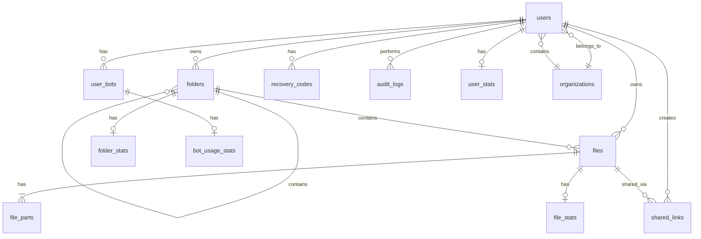

# Database Schema

The system uses a PostgreSQL database to manage users, folders, and file metadata.

## Table: `users`
Stores user accounts and their vault configuration.

| Column | Type | Description |
|--------|------|-------------|
| `id` | `TEXT` | Primary Key (UUID) |
| `username` | `TEXT` | Unique username |
| `password_hash` | `TEXT` | Bcrypt hash of login password |
| `master_password_hash` | `TEXT` | Hash of master password (for verification) |
| `encryption_salt` | `TEXT` | Random salt used for PBKDF2 |
| `tg_bot_token` | `TEXT` | Encrypted Telegram bot token (nullable) |
| `tg_user_id` | `TEXT` | Encrypted Telegram user/chat ID (nullable) |
| `organization_id` | `TEXT` | Foreign Key to `organizations.id` (nullable) |
| `encrypted_s3_config` | `TEXT` | Encrypted S3/R2 configuration (nullable) |
| `s3_config_iv` | `TEXT` | IV for S3 config encryption (nullable) |
| `s3_config_tag` | `TEXT` | Auth tag for S3 config encryption (nullable) |
| `recovery_codes_enabled` | `BOOLEAN` | Whether recovery codes are enabled (default: false) |
| `recovery_codes_generated_on_first_setup` | `BOOLEAN` | Whether codes were generated on setup (default: false) |
| `last_master_password_change` | `TIMESTAMP` | Last time master password was changed (nullable) |
| `created_at` | `TIMESTAMP` | Account creation timestamp |
| `updated_at` | `TIMESTAMP` | Last update timestamp |

## Table: `folders`
Manages the hierarchical directory structure.

| Column | Type | Description |
|--------|------|-------------|
| `id` | `TEXT` | Primary Key (UUID) |
| `user_id` | `TEXT` | Foreign Key to `users.id` |
| `name` | `TEXT` | Display name |
| `slug` | `TEXT` | URL-friendly name (unique per user/parent) |
| `parent_id` | `TEXT` | Foreign Key to `folders.id` (self-reference) |

## Table: `files`
Metadata for uploaded files.

| Column | Type | Description |
|--------|------|-------------|
| `id` | `TEXT` | Primary Key (UUID) |
| `user_id` | `TEXT` | Foreign Key to `users.id` (nullable) |
| `folder_id` | `TEXT` | Foreign Key to `folders.id` (nullable) |
| `telegram_file_id` | `TEXT` | Legacy single-chunk Telegram file ID (nullable) |
| `original_filename` | `TEXT` | Plaintext filename |
| `file_size` | `BIGINT` | Total unencrypted size in bytes |
| `file_type` | `TEXT` | File extension (nullable) |
| `mime_type` | `TEXT` | MIME Type (nullable) |
| `uploaded_at` | `TIMESTAMP` | Upload timestamp |
| `updated_at` | `TIMESTAMP` | Last update timestamp |
| `description` | `TEXT` | User description (nullable) |
| `tags` | `TEXT` | Comma-separated tags (nullable) |
| `is_encrypted` | `BOOLEAN` | Whether file is encrypted (default: false) |
| `encryption_algo` | `TEXT` | Encryption algorithm (e.g., AES-256-GCM) (nullable) |
| `encrypted_file_key` | `TEXT` | Encrypted file key for envelope encryption (nullable) |
| `key_iv` | `TEXT` | IV for file key encryption (nullable) |
| `encryption_version` | `INTEGER` | 1 = Direct, 2 = Envelope (default: 1) |
| `is_complete` | `BOOLEAN` | Whether all chunks uploaded (default: false) |
| `total_parts_expected` | `INTEGER` | Total number of expected chunks (default: 0) |
| `chunk_sizes` | `JSON` | Array of chunk sizes for resume support (nullable) |

## Table: `file_parts`
Metadata for individual encrypted chunks stored on Telegram.

| Column | Type | Description |
|--------|------|-------------|
| `id` | `TEXT` | Primary Key (UUID) |
| `file_id` | `TEXT` | Foreign Key to `files.id` |
| `telegram_file_id` | `TEXT`| The ID assigned by Telegram (opaque) |
| `part_number` | `INTEGER`| Order of the chunk |
| `size` | `BIGINT` | Size of this specific chunk |
| `iv` | `TEXT` | 12-byte Hex IV for AES-GCM |
| `auth_tag` | `TEXT` | 16-byte Hex Auth Tag for AES-GCM |

## Table: `user_bots`
Supports multiple Telegram bots per user.

| Column | Type | Description |
|--------|------|-------------|
| `id` | `TEXT` | Primary Key (UUID) |
| `user_id` | `TEXT` | Foreign Key to `users.id` |
| `bot_token` | `TEXT` | Encrypted token |
| `tg_user_id` | `TEXT` | Encrypted Chat/User ID |
| `is_default` | `BOOLEAN`| Default bot for uploads |

## Table: `settings`
Global application settings (legacy, single-row table).

| Column | Type | Description |
|--------|------|-------------|
| `id` | `INTEGER` | Primary Key (default: 1) |
| `telegram_bot_token` | `TEXT` | System-wide Telegram bot token |
| `telegram_user_id` | `TEXT` | System-wide Telegram user ID |
| `master_password_hash` | `TEXT` | Legacy master password hash (nullable) |
| `setup_complete` | `BOOLEAN` | Whether initial setup is complete (default: false) |
| `created_at` | `TIMESTAMP` | Created timestamp |
| `updated_at` | `TIMESTAMP` | Updated timestamp |

## Table: `recovery_codes`
Master password recovery codes (one-time use tokens).

| Column | Type | Description |
|--------|------|-------------|
| `id` | `TEXT` | Primary Key (UUID) |
| `user_id` | `TEXT` | Foreign Key to `users.id` |
| `code_hash` | `TEXT` | Bcrypt hash of recovery code |
| `used` | `BOOLEAN` | Whether code has been used (default: false) |
| `used_at` | `TIMESTAMP` | When code was used (nullable) |
| `created_at` | `TIMESTAMP` | Created timestamp |
| `expires_at` | `TIMESTAMP` | Expiration timestamp (nullable) |
| `burned_reason` | `TEXT` | Reason for code invalidation (nullable) |

## Table: `shared_links`
Public/protected file sharing links.

| Column | Type | Description |
|--------|------|-------------|
| `id` | `TEXT` | Primary Key (UUID) |
| `file_id` | `TEXT` | Foreign Key to `files.id` (CASCADE) |
| `user_id` | `TEXT` | Foreign Key to `users.id` (CASCADE) |
| `token` | `TEXT` | Unique public share token |
| `wrapped_file_key` | `TEXT` | Encrypted file key for sharing (nullable) |
| `key_iv` | `TEXT` | IV for wrapped key (nullable) |
| `is_password_protected` | `BOOLEAN` | Whether link requires password (default: false) |
| `password_hash` | `TEXT` | Bcrypt hash of share password (nullable) |
| `expires_at` | `TIMESTAMP` | Link expiration timestamp (nullable) |
| `views` | `INTEGER` | Number of times viewed (default: 0) |
| `downloads` | `INTEGER` | Number of downloads (default: 0) |
| `created_at` | `TIMESTAMP` | Created timestamp |
| `updated_at` | `TIMESTAMP` | Updated timestamp |

## Table: `audit_logs`
System audit trail for security and compliance.

| Column | Type | Description |
|--------|------|-------------|
| `id` | `UUID` | Primary Key (auto-generated) |
| `user_id` | `TEXT` | User performing action (nullable) |
| `action` | `TEXT` | Action performed (e.g., "login", "file_upload") |
| `resource_type` | `TEXT` | Type of resource (e.g., "file", "user") (nullable) |
| `resource_id` | `TEXT` | ID of affected resource (nullable) |
| `details` | `JSONB` | Additional action details (nullable) |
| `ip_address` | `TEXT` | Client IP address (nullable) |
| `user_agent` | `TEXT` | Client user agent string (nullable) |
| `created_at` | `TIMESTAMP` | Log entry timestamp |

## Table: `user_stats`
Aggregated statistics per user.

| Column | Type | Description |
|--------|------|-------------|
| `id` | `TEXT` | Primary Key (UUID) |
| `user_id` | `TEXT` | Foreign Key to `users.id` (unique, CASCADE) |
| `total_files` | `INTEGER` | Total file count (default: 0) |
| `total_size` | `BIGINT` | Total storage used in bytes (default: 0) |
| `total_uploads` | `INTEGER` | Upload counter (default: 0) |
| `total_downloads` | `INTEGER` | Download counter (default: 0) |
| `created_at` | `TIMESTAMP` | Created timestamp |
| `updated_at` | `TIMESTAMP` | Updated timestamp |

## Table: `folder_stats`
Statistics per folder (if implemented).

| Column | Type | Description |
|--------|------|-------------|
| `id` | `TEXT` | Primary Key (UUID) |
| `folder_id` | `TEXT` | Foreign Key to `folders.id` (unique, CASCADE) |
| `file_count` | `INTEGER` | Number of files in folder (default: 0) |
| `total_size` | `BIGINT` | Total size of folder contents (default: 0) |
| `updated_at` | `TIMESTAMP` | Updated timestamp |

## Table: `file_stats`
Per-file statistics (views, downloads).

| Column | Type | Description |
|--------|------|-------------|
| `id` | `TEXT` | Primary Key (UUID) |
| `file_id` | `TEXT` | Foreign Key to `files.id` (unique, CASCADE) |
| `views` | `INTEGER` | View count (default: 0) |
| `downloads` | `INTEGER` | Download count (default: 0) |
| `last_accessed` | `TIMESTAMP` | Last access timestamp (nullable) |
| `created_at` | `TIMESTAMP` | Created timestamp |
| `updated_at` | `TIMESTAMP` | Updated timestamp |

## Table: `bot_usage_stats`
Statistics per Telegram bot.

| Column | Type | Description |
|--------|------|-------------|
| `id` | `TEXT` | Primary Key (UUID) |
| `bot_id` | `TEXT` | Foreign Key to `user_bots.id` (CASCADE) |
| `files_stored` | `INTEGER` | Number of files stored (default: 0) |
| `total_size` | `BIGINT` | Total size stored (default: 0) |
| `last_used` | `TIMESTAMP` | Last usage timestamp (nullable) |
| `created_at` | `TIMESTAMP` | Created timestamp |
| `updated_at` | `TIMESTAMP` | Updated timestamp |

## Table: `organizations`
Multi-tenant organization support.

| Column | Type | Description |
|--------|------|-------------|
| `id` | `TEXT` | Primary Key (UUID) |
| `name` | `TEXT` | Organization name |
| `encrypted_s3_config` | `TEXT` | Org-wide S3 config (nullable) |
| `s3_config_iv` | `TEXT` | IV for S3 config encryption (nullable) |
| `s3_config_tag` | `TEXT` | Auth tag for S3 config (nullable) |
| `created_at` | `TIMESTAMP` | Created timestamp |
| `updated_at` | `TIMESTAMP` | Updated timestamp |

## Entity Relationship Diagram

