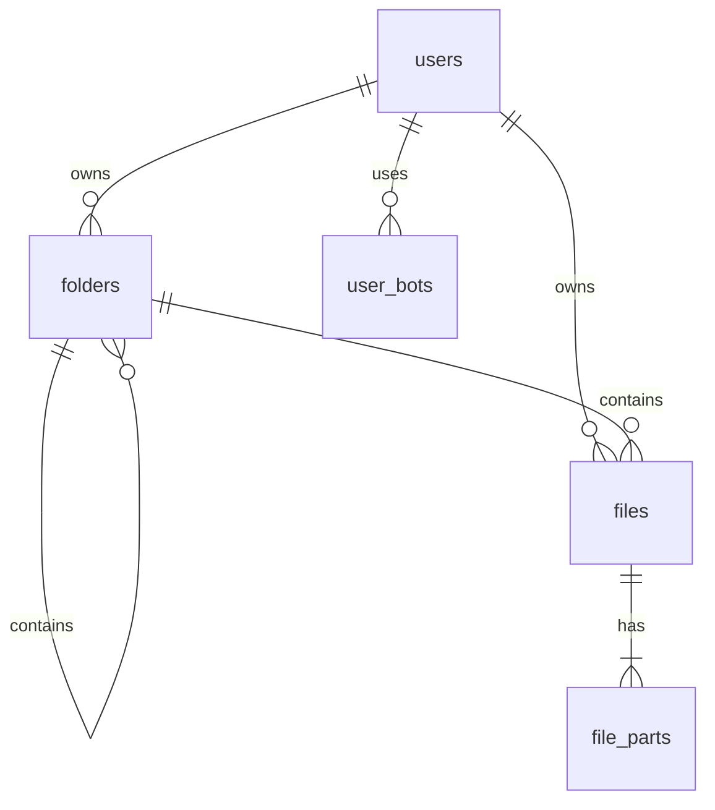

# Database Schema

The system uses a PostgreSQL database to manage users, folders, and file metadata.

## Table: `users`
Stores user accounts and their vault configuration.

| Column | Type | Description |
|--------|------|-------------|
| `id` | `TEXT` | Primary Key (UUID) |
| `username` | `TEXT` | Unique username |
| `password_hash` | `TEXT` | Bcrypt hash of login password |
| `master_password_hash` | `TEXT` | Hash of master password (for verification) |
| `encryption_salt` | `TEXT` | Random salt used for PBKDF2 |
| `tg_bot_token` | `TEXT` | Encrypted Telegram bot token |
| `tg_user_id` | `TEXT` | Encrypted Telegram user/chat ID |

## Table: `folders`
Manages the hierarchical directory structure.

| Column | Type | Description |
|--------|------|-------------|
| `id` | `TEXT` | Primary Key (UUID) |
| `user_id` | `TEXT` | Foreign Key to `users.id` |
| `name` | `TEXT` | Display name |
| `slug` | `TEXT` | URL-friendly name (unique per user/parent) |
| `parent_id` | `TEXT` | Foreign Key to `folders.id` (self-reference) |

## Table: `files`
Metadata for uploaded files.

| Column | Type | Description |
|--------|------|-------------|
| `id` | `TEXT` | Primary Key (UUID) |
| `user_id` | `TEXT` | Foreign Key to `users.id` |
| `folder_id` | `TEXT` | Foreign Key to `folders.id` |
| `original_filename` | `TEXT` | Plaintext filename |
| `file_size` | `BIGINT` | Total unencrypted size in bytes |
| `mime_type` | `TEXT` | MIME Type |
| `is_encrypted` | `BOOLEAN`| Always `true` for new uploads |

## Table: `file_parts`
Metadata for individual encrypted chunks stored on Telegram.

| Column | Type | Description |
|--------|------|-------------|
| `id` | `TEXT` | Primary Key (UUID) |
| `file_id` | `TEXT` | Foreign Key to `files.id` |
| `telegram_file_id` | `TEXT`| The ID assigned by Telegram (opaque) |
| `part_number` | `INTEGER`| Order of the chunk |
| `size` | `BIGINT` | Size of this specific chunk |
| `iv` | `TEXT` | 12-byte Hex IV for AES-GCM |
| `auth_tag` | `TEXT` | 16-byte Hex Auth Tag for AES-GCM |

## Table: `user_bots`
Supports multiple Telegram bots per user.

| Column | Type | Description |
|--------|------|-------------|
| `id` | `TEXT` | Primary Key (UUID) |
| `user_id` | `TEXT` | Foreign Key to `users.id` |
| `bot_token` | `TEXT` | Encrypted token |
| `tg_user_id` | `TEXT` | Encrypted Chat/User ID |
| `is_default` | `BOOLEAN`| Default bot for uploads |

## Entity Relationship Diagram

